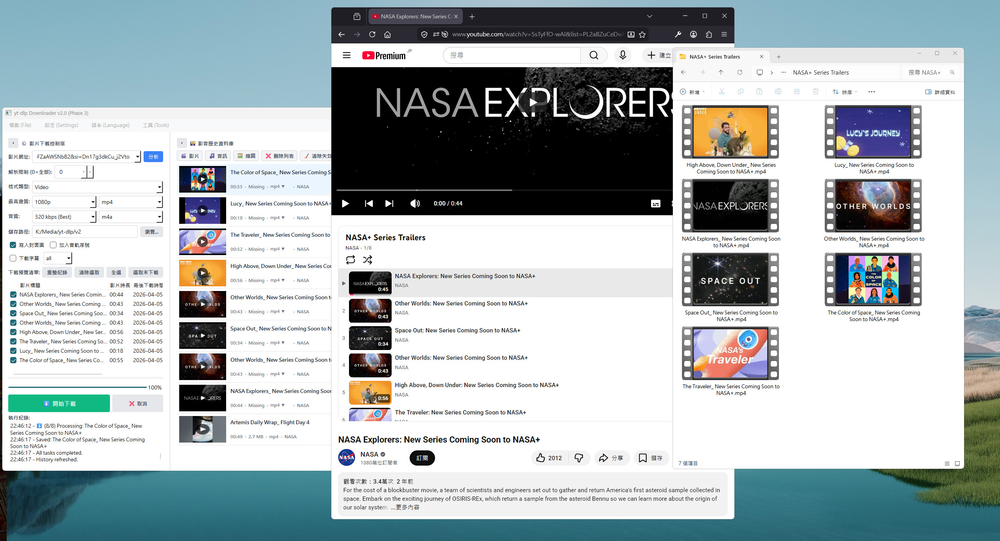

# 🚀 yt-dlp Downloader GUI v2.0 (Beta)

A modernized, database-driven graphical interface for [yt-dlp](https://github.com/yt-dlp/yt-dlp). Rebuilt from the ground up with **PyQt6** for a superior, high-performance media extraction experience.

## ◼ v2.0 Beta Evolution

The second generation marks a significant shift from Tkinter to **PyQt6**, introducing a robust database architecture and a more flexible workspace.

* **PyQt6 Refactor**: Full UI migration for smoother animations and native High-DPI scaling.
* **Smart Sidebar**: Innovative `<` and `>` toggle system to collapse/expand the Control Tower and History Gallery.
* **SQLite History Manager**: Persistent storage for all downloads with a card-style preview interface.
* **One-Click Workflow**: Directly re-download or open local directories via the history context menu.

## ◼ Core Features

* **Ultra HD Support**: Precision extraction for 4K/2K video (AV1/VP9) and high-bitrate audio (MP3/320kbps).
* **Trilingual UI**: Instant switching between **English**, **繁體中文**, and **日本語**.
* **Standalone Portability**: Single-file execution with bundled **FFmpeg/FFprobe** binaries. No setup required.
* **Advanced Subtitles**: Standalone subtitle retrieval and conversion to SRT format.
* **Batch Engine**: Efficient parsing and downloading of entire playlists with user-defined limits.

## ◼ Installation

1.  Visit the **[Releases](https://github.com/bluesjamgt/yt-dlp-gui/releases/latest)** page.
2.  Download the `ytdlpgui_v2_beta.exe`.
3.  Launch the app. 
    * *Note: Local database (`history.db`) and config will be stored in the `ytdlp_data/` directory.*

## ◼ Technical Specs

* **Framework**: Python 3.10+ / PyQt6
* **Engine**: yt-dlp (2026.03.03+)
* **Database**: SQLite 3
* **Dependency**: Bundled FFmpeg. (Node.js/Deno recommended for optimal decryption speed).

## ◼ Credits & License

* **Lead Development**: Bluz J & AI Assistant (Nai)
* **Core Logic**: Powered by [yt-dlp](https://github.com/yt-dlp/yt-dlp).
* **License**: Intended for personal archiving and technical research. Users are responsible for adhering to platform Terms of Service.
